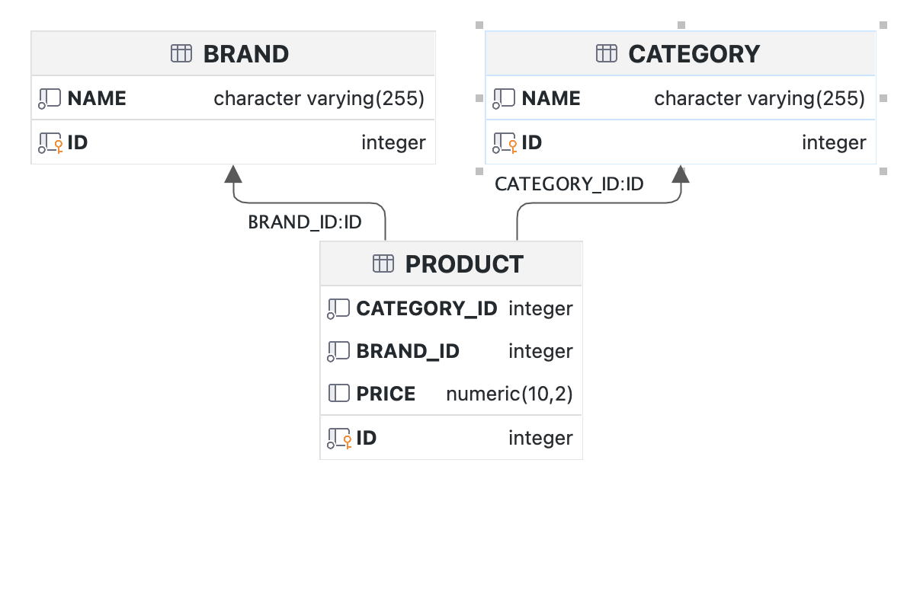

# Get Your OOTD


카테고리에서 상품을 하나씩 구매하여, 코디를 완성하는 서비스 간단한 `Java/Spring` 기반의 API 서버 입니다.


## 필수 사용 기술

* Java `17`
* Spring Boot `3.3.2`
* Gradle
* JPA
* H2
* Querydsl

## 구현한 API
- 아래 링크에 접속하시면 구현된 API 목록이 나타납니다.
- [API 명세](https://documenter.getpostman.com/view/19769673/2sA3s7iUZd)
- **서버 실행 시 테스트 데이터만 DB에 있는 상태입니다.**

## Quick Start
- **애플리케이션 포트는 `8080` 입니다.**

- 루트 디렉토리에 Postman으로 테스트 가능한 `OOTD.postman_collection.json` 파일을 첨부했습니다.

### - 실행 방법

- 애플리케이션 실행 시 테이블과 주어진 테스트데이터를 생성하도록 설정했습니다.
```shell
./gradlew bootRun
```

### - 테스트 방법
```shell
./gradlew test
```


## 프로젝트 구조

### - ERD




### - 디렉터리 구조

```agsl
├── java
│   └── com
│       └── oioioihi
│           └── ootd
│               ├── controller
│               ├── exception
│               ├── model
│               │   ├── dao
│               │   ├── dto
│               │   │   └── request
│               │   └── entity
│               ├── repository
│               └── service
└── resources

```


